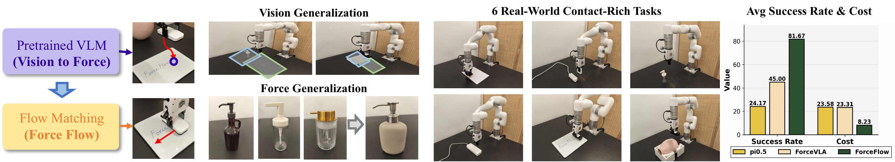

# ForceFlow: Learning to Feel and Act via Contact-Driven Flow Matching

[[Project Page](https://jokeresc.github.io/ForceFlow-page)]



ForceFlow is a force-aware reactive framework for contact-rich robot manipulation. Existing vision-based policies fail in contact-intensive tasks because visual feedback cannot capture high-frequency contact dynamics. ForceFlow addresses this with an asymmetric multimodal fusion strategy: force/torque history is injected as a global regulation signal to prevent it from being overshadowed by high-dimensional visual features, while a hybrid action space jointly predicts motion commands and expected contact forces to enable proactive compliance. ForceFlow achieves 81.67% average success rate across six real-world tasks, outperforming the state-of-the-art force-aware baseline by 37%.

## Installation

```bash
# 1. Clone with submodules
git clone --recurse-submodules https://github.com/JokerESC/ForceFlow.git
cd ForceFlow

# 2. Install Python dependencies
pip install -r requirements.txt

# 3. Install CleanDiffuser (submodule, editable)
pip install -e CleanDiffuser/
```

## Workflow

### 1. Configure

Edit `configs/xarm.yaml` and fill in your task name and paths:

```yaml
task: your_task_name          # used for directory naming
dataset_path: data/<task>.zarr
normalizer_path: data/<task>.zarr/<task>_normalizer.json
```

### 2. Collect Data

```bash
# Edit DATASET_PATH and NUM_EPISODES at the top of the script
python -m scripts.collect
```

- Press **Space** to start recording an episode
- Press **Enter** to end the episode
- SpaceMouse buttons control gripper open/close

### 3. Validate Dataset and Compute Normalizers

```bash
# Edit DATASET_PATH at the top of the script
python -m scripts.validate
```

This validates the dataset structure, fixes `episode_ends`, and saves a `<task>_normalizer.json` file required for training and inference.

### 4. Train

```bash
python -m pipeline.train --config configs/xarm.yaml
```

Checkpoints are saved to `checkpoints/<task>/`. Training uses W&B logging by default (set `wandb.enable: false` to disable).

### 5. Run Inference

```bash
python -m pipeline.inference --config configs/xarm.yaml
```

- Press **Enter** to start inference after positioning the robot
- The policy predicts `horizon` steps and executes `Ta` of them before re-planning

## Configuration Reference

| Parameter | Description |
|-----------|-------------|
| `task` | Task name; used for all path templates |
| `horizon` | Action sequence length predicted by the model |
| `Ta` | Steps executed per inference call (`Ta <= horizon`) |
| `To` | Number of observation history frames |
| `T_force` | Force history window length |
| `batch_size` | Training batch size |
| `max_steps` | Total training steps |
| `image_size` | Image resize target (default 224) |
| `precision` | PyTorch Lightning precision (`bf16-mixed` recommended) |

## Model Architecture

- **Policy**: Continuous Rectified Flow (flow matching) over 13-dim actions
- **Action**: 6-dim pose delta + 1-dim gripper + 6-dim predicted contact force
- **Condition**: Dual-view ResNet18 image features (seq) + flattened force history + pose/gripper state (vec)
- **Backbone**: DiT1d with cross-attention conditioning

## Hardware

| Component | Details |
|-----------|---------|
| Robot arm | UFACTORY xArm6 with 6-axis F/T sensor |
| Cameras | Intel RealSense L515 + D435 |
| Teleoperation | 3Dconnexion SpaceMouse |

## License

MIT — see [LICENSE](LICENSE). CleanDiffuser submodule has its own license in `CleanDiffuser/LICENCE.txt`.


